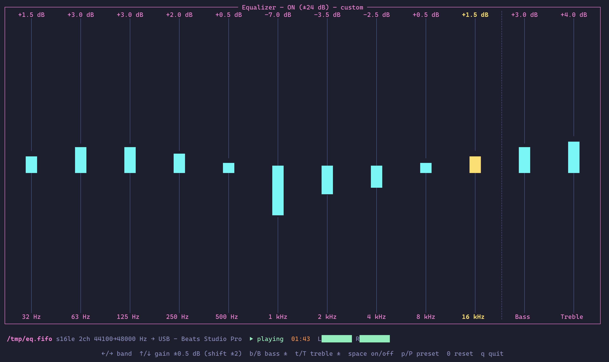

# equalizer

A real-time terminal equalizer for raw PCM pipes. It reads audio from
**stdin**, a **FIFO**, or a **unix socket**, runs it through the
[Rockbox DSP](https://crates.io/crates/rockbox-dsp) (10-band EQ,
bass/treble shelves, resampling) and plays the result on your sound card
via [cpal](https://crates.io/crates/cpal) — while a
[ratatui](https://ratatui.rs) interface lets you tweak the bands live.



## Table of Contents

- [Features](#features)
- [Installation](#installation)
- [Quick Start](#quick-start)
- [Input Sources](#input-sources)
  - [stdin pipe](#stdin-pipe)
  - [FIFO (named pipe)](#fifo-named-pipe)
  - [Unix socket](#unix-socket)
- [CLI Options](#cli-options)
- [Keybindings](#keybindings)
- [Presets](#presets)
- [Settings File](#settings-file)
- [How It Works](#how-it-works)
- [Testing](#testing)
- [License](#license)

## Features

- **10-band equalizer** — the actual Rockbox firmware DSP (low shelf,
  8 peaking filters, high shelf), ±24 dB per band
- **Bass & treble** tone controls (±24 dB shelves at 200 Hz / 3.5 kHz),
  active independently of the EQ switch, just like Rockbox
- **Live TUI** — vertical sliders for every band plus Bass/Treble columns,
  a status line (input format, sample rates, output device, playback state,
  stereo level meter, elapsed time) and a key-hint bar at the bottom
- **Any raw PCM source** — stdin, FIFO, or unix socket; `s16le`, `s24le`,
  `s32le`, `f32le`, `f64le`; mono/stereo/multichannel; any sample rate
  (resampled to the device rate by the DSP)
- **Persistent settings** — every change is saved to a TOML file and
  restored on the next run
- **Presets** — rock, pop, jazz, classical, electronic, vocal,
  bass-boost, treble-boost, flat

## Installation

```sh
git clone https://github.com/tsirysndr/equalizer
cd equalizer
cargo install --path .
```

Requires a C compiler (the `rockbox-dsp` crate compiles the Rockbox DSP
sources with `cc`).

## Quick Start

Pipe anything through ffmpeg into the equalizer:

```sh
ffmpeg -i track.flac -f s16le -ac 2 -ar 44100 - 2>/dev/null | equalizer
```

The TUI opens on your terminal (it renders to stderr and reads keys from
`/dev/tty`, so stdin stays free for audio). Adjust bands with the arrow
keys — changes are audible immediately and saved automatically.

## Input Sources

### stdin pipe

`-` (the default) reads raw PCM from stdin:

```sh
# ffmpeg
ffmpeg -i song.mp3 -f s16le -ac 2 -ar 44100 - 2>/dev/null | equalizer

# sox
sox song.wav -t raw -b 16 -e signed -c 2 -r 44100 - | equalizer

# float samples at 48 kHz
ffmpeg -i song.mp3 -f f32le -ac 2 -ar 48000 - 2>/dev/null | equalizer -f f32le -r 48000
```

### FIFO (named pipe)

Point `equalizer` at a path — if it doesn't exist it is **created as a
FIFO**, and the equalizer waits for a writer:

```sh
equalizer /tmp/eq.fifo
```

then from another process (repeatable — the FIFO is reopened after each
writer disconnects):

```sh
ffmpeg -i first.flac  -f s16le -ac 2 -ar 44100 -y /tmp/eq.fifo
ffmpeg -i second.flac -f s16le -ac 2 -ar 44100 -y /tmp/eq.fifo
```

### Unix socket

If the path is an existing unix domain socket, `equalizer` connects to it
and reads PCM from the peer:

```sh
equalizer /tmp/audio.sock
```

## CLI Options

| Flag | Default | Description |
|------|---------|-------------|
| `[INPUT]` | `-` | Input path (`-` = stdin, missing path → FIFO is created) |
| `-r, --rate <HZ>` | `44100` | Input sample rate |
| `-c, --channels <N>` | `2` | Input channels (1 = upmixed, >2 = front pair) |
| `-f, --format <FMT>` | `s16le` | `s16le`, `s24le`, `s32le`, `f32le`, `f64le` |
| `-d, --device <NAME>` | default | Output device (case-insensitive substring) |
| `--list-devices` | | Print output devices and exit |
| `-p, --preset <NAME>` | | Apply a [preset](#presets) on startup |
| `--config <PATH>` | user config dir | Settings file location |
| `--no-tui` | | Headless: apply saved settings, no interface |

## Keybindings

| Key | Action |
|-----|--------|
| `←` / `→` (or `h` / `l`) | Select column (10 bands, Bass, Treble) |
| `↑` / `↓` (or `k` / `j`, `+` / `-`) | Adjust selected: bands ±0.5 dB, shelves ±1 dB |
| `Shift` + `↑`/`↓` | Coarse adjust: bands ±2 dB, shelves ±4 dB |
| `b` / `B` | Bass +1 / −1 dB (without moving the selection) |
| `t` / `T` | Treble +1 / −1 dB |
| `Space` (or `e`) | Toggle EQ on/off (bass/treble stay active) |
| `p` / `P` | Next / previous preset |
| `0` (or `r`) | Reset all gains to flat |
| `s` | Save settings now (changes also auto-save after a short pause) |
| `q` / `Esc` / `Ctrl-C` | Quit |

## Presets

`flat`, `rock`, `pop`, `jazz`, `classical`, `electronic`, `vocal`,
`bass-boost`, `treble-boost`

Apply one at startup with `--preset rock`, or cycle with `p` / `P` in the
TUI. A preset replaces the band gains (cutoffs and Q are kept); editing
any band afterwards marks the state as `custom`.

## Settings File

Settings live at `~/Library/Application Support/io.tsirysndr.equalizer/settings.toml`
on macOS (`~/.config/equalizer` on Linux, override with `--config`) and use
Rockbox's `[[eq_band_settings]]` format — `gain` and `q` are stored ×10:

```toml
eq_enabled = true
bass = 2          # dB, low shelf @ 200 Hz (0 = off)
treble = 0        # dB, high shelf @ 3.5 kHz
bass_cutoff = 0   # Hz, 0 = default 200
treble_cutoff = 0 # Hz, 0 = default 3500

[[eq_band_settings]]
cutoff = 32   # Hz
q = 7         # Q 0.7
gain = 50     # +5.0 dB
# … 9 more bands: 63, 125, 250, 500, 1k, 2k, 4k, 8k, 16k
```

Every change in the TUI is persisted immediately, so the next run starts
where you left off.

## How It Works

```
stdin / FIFO / socket ──▶ reader thread ──▶ bounded channel ──▶ cpal callback ──▶ 🔊
      raw PCM             decode to s16          3 × ~10 ms         output device
                          fold to stereo
                          Rockbox DSP:
                          EQ → tone → resample
                                ▲
                          version counter
                                │
                          ratatui TUI (your keystrokes)
```

The Rockbox DSP instance is not `Send`, so it lives entirely on the reader
thread. The TUI mutates a shared `Equalizer` state and bumps an atomic
version counter; the reader notices the change on the next chunk and
reapplies the settings — the small post-DSP buffer keeps the latency of an
EQ tweak around 50 ms.

## Testing

```sh
cargo test
```

Covers PCM decoding (all five formats, sign extension, clamping), channel
folding, TOML settings round-trips, meter rendering, and an end-to-end DSP
test that verifies a −12 dB band cut actually attenuates a sine tone.

For a quick listen without a media file:

```sh
# 30 s of pink-ish noise through a bass-boost
ffmpeg -f lavfi -i "anoisesrc=color=pink:duration=30" \
       -f s16le -ac 2 -ar 44100 - 2>/dev/null | equalizer --preset bass-boost
```

## License

[GPL-2.0-or-later](LICENSE) — the `rockbox-dsp` crate compiles Rockbox
firmware code, which is GPL-2.0-or-later, so this project is too.
